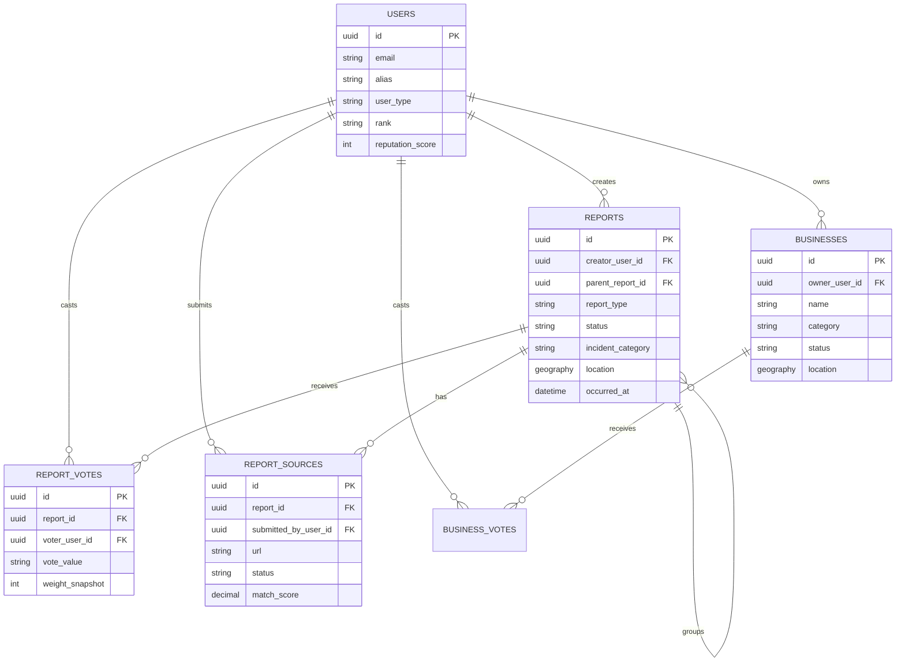
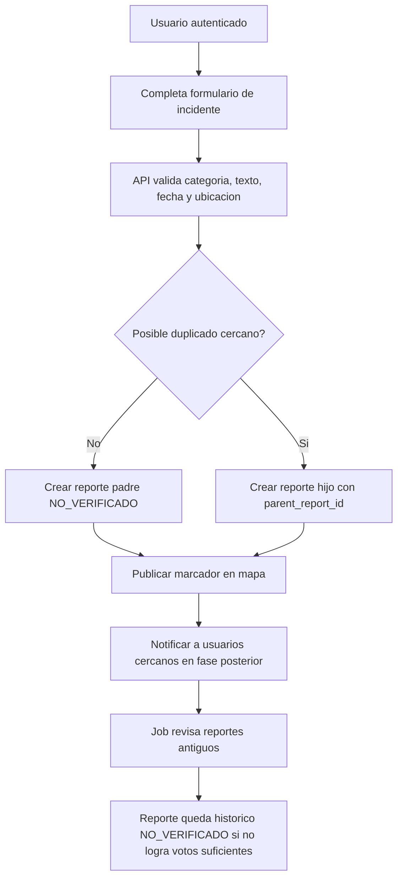
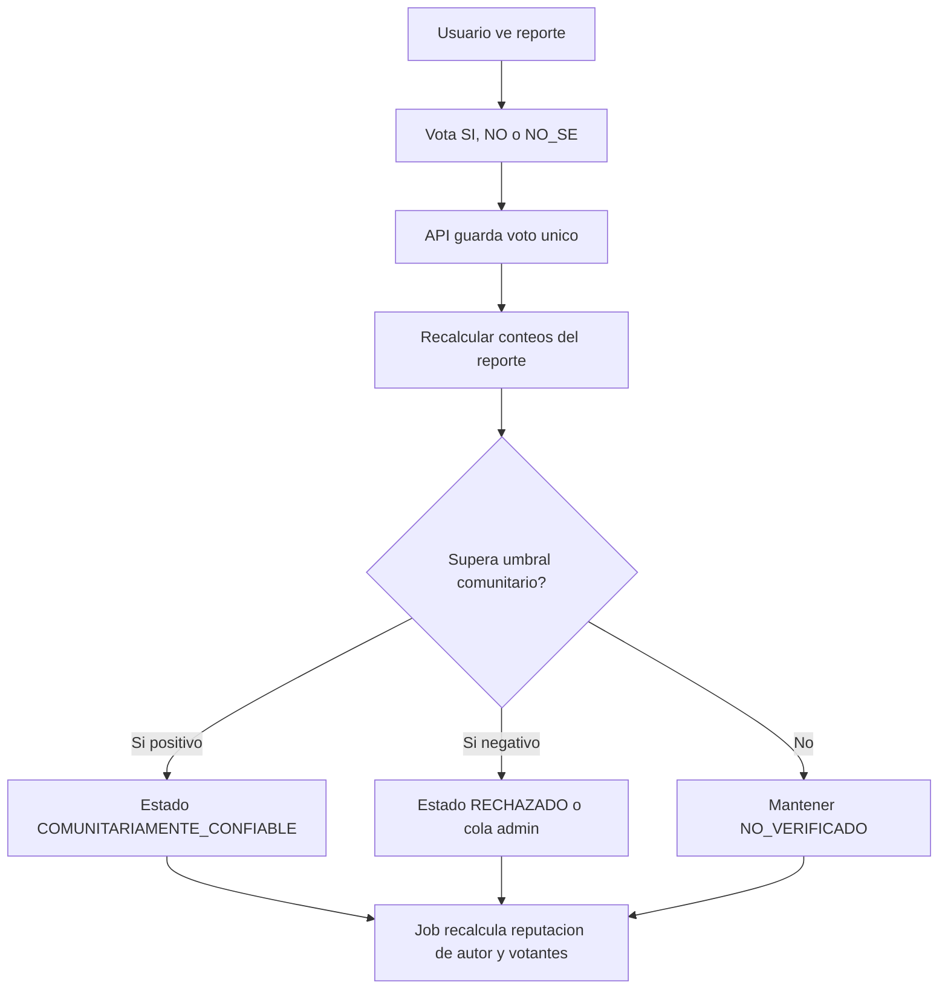
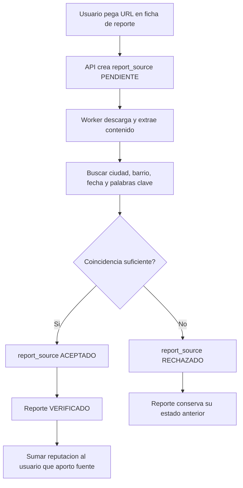
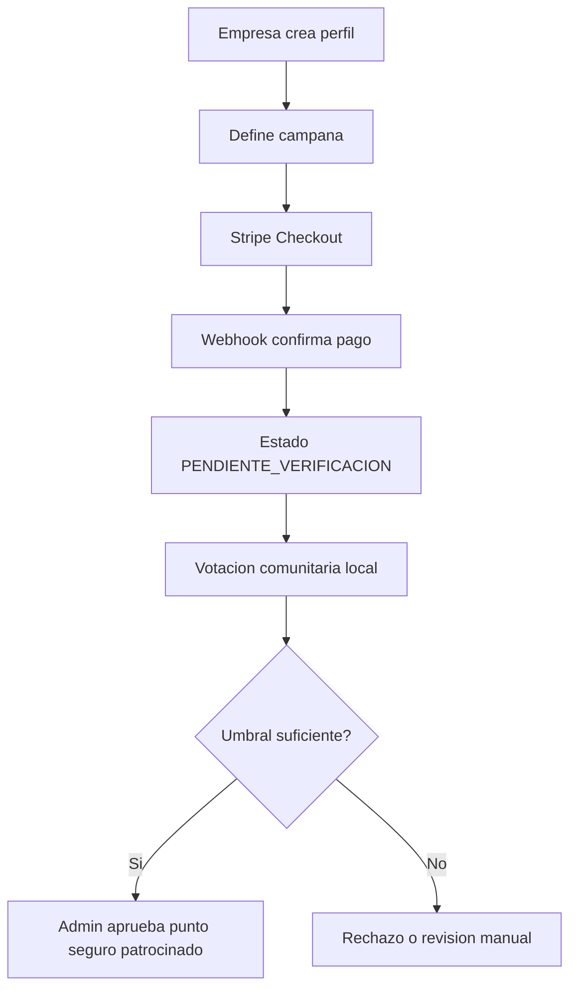

# 01 - Modelo de Datos y Flujos

Estado: borrador v0.1

## Supuestos tecnicos

- Base de datos local actual: SQLite.
- Base de datos futura: PostgreSQL con PostGIS.
- Identificadores: UUID.
- Campos comunes: `created_at`, `updated_at`.
- Borrado: preferir ocultamiento o soft delete para auditoria, no eliminacion fisica inmediata.
- Coordenadas: almacenar `lat`/`lng` del incidente, no ubicacion en vivo del usuario.

## Enums v1

```text
user_type:
  CITIZEN
  BUSINESS
  ADMIN

report_type:
  INSTANTANEO
  OFICIAL

report_status:
  NO_VERIFICADO
  COMUNITARIAMENTE_CONFIABLE
  VERIFICADO
  RECHAZADO
  OCULTO

vote_value:
  SI
  NO
  NO_SE

business_status:
  BORRADOR
  PENDIENTE_PAGO
  PENDIENTE_VERIFICACION
  APROBADO
  RECHAZADO
  SUSPENDIDO

source_status:
  PENDIENTE
  ACEPTADO
  RECHAZADO
  ERROR
```

## Tablas principales

### users

Representa ciudadanos, empresas y admins.

Campos sugeridos:

- `id`
- `email`
- `password_hash`
- `alias`
- `photo_url`
- `user_type`
- `rank`
- `reputation_score`
- `reports_verified_count`
- `reports_unverified_count`
- `reports_rejected_count`
- `votes_cast_count`
- `last_login_at`
- `is_active`

Notas:

- `email` no debe ser publico.
- `alias`, `rank`, `reputation_score` y contadores si pueden ser publicos.

### businesses

Representa empresas o lugares que quieren aparecer como puntos seguros en fases posteriores.

Campos sugeridos:

- `id`
- `owner_user_id`
- `name`
- `category`
- `description`
- `address_text`
- `location`
- `status`
- `reputation_score`
- `sponsor_label`
- `approved_at`
- `rejected_reason`

### reports

Representa incidentes reportados.

Campos sugeridos:

- `id`
- `creator_user_id`
- `report_type`
- `status`
- `title`
- `description`
- `incident_category`
- `occurred_at`
- `location`
- `city`
- `neighborhood`
- `parent_report_id`
- `duplicate_group_count`
- `community_yes_count`
- `community_no_count`
- `community_unknown_count`
- `community_score`
- `verified_at`
- `hidden_at`
- `hidden_reason`

Notas:

- `parent_report_id` permite agrupar duplicados.
- Un reporte padre resume el incidente; los hijos conservan trazabilidad.
- `description` debe ser moderable y nunca debe requerir datos personales.

### report_votes

Representa votos comunitarios sobre reportes.

Campos sugeridos:

- `id`
- `report_id`
- `voter_user_id`
- `vote_value`
- `weight_snapshot`
- `reason`

Restricciones:

- Un usuario solo puede votar una vez por reporte.
- El creador del reporte no debe votar su propio reporte.

### business_votes

Representa validacion comunitaria de negocios o puntos seguros.

Campos sugeridos:

- `id`
- `business_id`
- `voter_user_id`
- `vote_value`
- `weight_snapshot`
- `reason`

### report_sources

Representa noticias o fuentes aportadas para verificar reportes.

Campos sugeridos:

- `id`
- `report_id`
- `submitted_by_user_id`
- `url`
- `source_domain`
- `title`
- `published_at`
- `extracted_text_hash`
- `status`
- `match_score`
- `reviewed_at`
- `review_notes`

## Diagrama ER



## Indices importantes

- `reports.location` con indice GiST.
- `reports.occurred_at`.
- `reports.status`.
- `reports.parent_report_id`.
- `report_votes(report_id, voter_user_id)` unico.
- `report_sources(report_id, url)` unico.
- `business_votes(business_id, voter_user_id)` unico.

## Flujo: crear reporte instantaneo



Regla inicial de duplicado:

- Misma ciudad.
- Misma categoria o categoria compatible.
- Distancia menor o igual a 150 metros.
- Diferencia de tiempo menor o igual a 2 horas.
- Si hay varios candidatos, usar como padre el reporte mas antiguo con mayor score.

## Flujo: votos y reputacion



Regla inicial de confianza comunitaria:

- `SI` ponderado mayor o igual a 5.
- Ratio `SI / (SI + NO)` mayor o igual a 0.7.
- Al menos 3 usuarios distintos.

Regla inicial de rechazo:

- `NO` ponderado mayor o igual a 5.
- Ratio `NO / (SI + NO)` mayor o igual a 0.7.
- Enviar a cola admin antes de ocultar si contiene lenguaje sensible.

## Flujo: aportar noticia

Este flujo pertenece a una fase posterior, pero el modelo queda preparado.



## Flujo: empresa patrocinada

Este flujo queda fuera del MVP civico inicial.



## Reputacion v1

Reglas iniciales simples:

- +3 puntos si un reporte del usuario llega a `COMUNITARIAMENTE_CONFIABLE`.
- +5 puntos si un reporte llega a `VERIFICADO` por fuente aceptada.
- +1 punto si un voto del usuario coincide con el resultado final.
- -2 puntos si un reporte queda `RECHAZADO`.
- -10 puntos y revision admin si hay abuso repetido o datos personales publicados.

Rangos iniciales:

- `NUEVO`: 0 a 9 puntos.
- `COLABORADOR`: 10 a 49 puntos.
- `CONFIABLE`: 50 a 149 puntos.
- `GUARDIAN`: 150 o mas puntos.

Los nombres de rangos deben validarse con usuarios piloto para evitar tono policial o vigilante.
