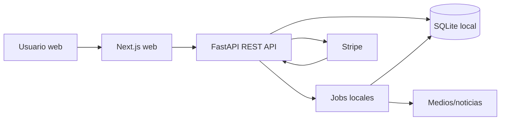

# 02 - Arquitectura Tecnica

Estado: borrador v0.1

## Stack propuesto

Frontend:

- Next.js con React.
- Leaflet sobre OpenStreetMap para el mapa del MVP.
- Mapbox puede evaluarse despues si se necesita mejor geocodificacion, estilos o analitica.

Backend API:

- FastAPI.
- REST JSON.
- Autenticacion con cookies `HttpOnly` y tokens firmados.

Base de datos local:

- SQLite para el prototipo y desarrollo inmediato.
- Campos `lat`/`lng` y calculo simple de distancia para duplicados.

Base de datos futura:

- PostgreSQL.
- PostGIS para consultas geoespaciales robustas.

Workers y jobs:

- Jobs locales ejecutables con `python -m app.jobs.local`.
- Redis + RQ puede entrar despues si los jobs crecen mucho.

Pagos:

- Stripe Checkout y webhooks en fase posterior.

Infra local:

- API y web corriendo directo en la maquina.
- SQLite como base local.

## Diagrama de arquitectura



## Estructura de repo propuesta

```text
rutasegura/
  apps/
    web/
      # Next.js
    api/
      # FastAPI
  workers/
    scraper/
      # Jobs de fuentes/noticias
  infra/
    # Infra futura
  docs/
    # Documentacion de producto, arquitectura y gobierno
```

## Modulos backend

Modulos iniciales:

- `auth`: registro, login, refresh, logout.
- `users`: perfil publico, alias, rango y reputacion.
- `reports`: creacion, listado, detalle, agrupacion de duplicados.
- `votes`: votos de reportes y conteos.
- `moderation`: ocultar reportes, revisar abuso, manejar reportes sensibles.
- `jobs`: tareas programadas de reputacion, estados y duplicados.

Modulos posteriores:

- `sources`: URLs, scraping, reglas de verificacion.
- `businesses`: perfiles de empresas y puntos seguros.
- `payments`: Stripe Checkout, webhooks y estados de campana.
- `admin`: herramientas de revision y auditoria.

## Endpoints MVP

```text
POST   /auth/register
POST   /auth/login
POST   /auth/logout
GET    /me
PATCH  /me

GET    /users/{id}

POST   /reports
GET    /reports
GET    /reports/{id}
GET    /reports/{id}/children

POST   /reports/{id}/votes
GET    /reports/{id}/votes/summary

POST   /admin/reports/{id}/hide
POST   /admin/reports/{id}/restore
```

Filtros clave para `GET /reports`:

- `bbox`: area visible del mapa.
- `status`.
- `category`.
- `from` y `to`.
- `city`.
- `include_children`.

## Jobs MVP

Jobs iniciales:

- Recalcular conteos y score de reportes.
- Recalcular reputacion y rango de usuarios.
- Marcar como historicos los reportes instantaneos antiguos.
- Reagrupar duplicados cuando cambian datos relevantes.
- Detectar posible abuso por volumen, texto repetido o reportes rechazados.

Frecuencia inicial:

- Conteos: al votar y como job de consistencia.
- Reputacion: cada noche.
- Reportes antiguos: cada hora.
- Abuso: cada hora o por evento.

## Seguridad y privacidad

Decisiones iniciales:

- Cookies `HttpOnly`, `Secure` y `SameSite=Lax` en produccion.
- Rate limit en registro, login, creacion de reportes y votos.
- No exponer email ni datos privados en perfiles publicos.
- Guardar ubicacion del incidente, no tracking del usuario.
- Logs sin contrasenas, tokens ni datos personales sensibles.
- Panel admin con auditoria de acciones.

## Observabilidad minima

MVP:

- Logs estructurados en API y worker.
- Metricas simples: reportes creados, votos, reportes ocultos, errores de jobs.
- Health checks para API, DB local y jobs.

Despues:

- Trazas distribuidas.
- Dashboards por barrio/zona.
- Alertas por errores de scraper o webhooks de Stripe.

## Orden tecnico sugerido

1. Crear monorepo basico con `apps/web` y `apps/api`.
2. Levantar SQLite con Alembic.
3. Implementar migraciones y modelos MVP.
4. Implementar auth y perfiles.
5. Implementar reportes + mapa.
6. Implementar votos + reputacion.
7. Implementar duplicados.
8. Implementar moderacion minima.
